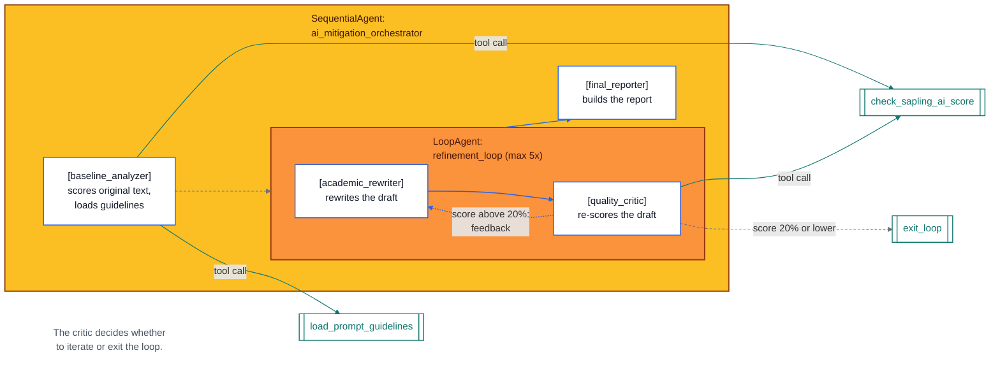

# AI Detection Mitigation Pipeline

A multi-agent pipeline (built with Google ADK) that takes any text and iteratively rewrites it until an AI-detection score drops below a target threshold — or a max number of attempts runs out.

## Architecture

```
ai_mitigation_orchestrator (SequentialAgent)
├── baseline_analyzer
├── refinement_loop (LoopAgent, max 5 iterations)
│   ├── academic_rewriter
│   └── quality_critic
└── final_reporter
```

- **`ai_mitigation_orchestrator`** is the root `SequentialAgent`. It runs three stages in order: `baseline_analyzer` → `refinement_loop` → `final_reporter`.
- **`refinement_loop`** is a `LoopAgent` nested as the middle stage of the sequential root. It repeats `academic_rewriter` → `quality_critic` up to 5 times.



Every stage passes what the next one needs through shared **session state**, instead of re-sending full conversation history. This keeps token usage roughly flat no matter how many loop iterations run.

## How it works

1. **Input arrives** — the root agent starts, running `baseline_analyzer` first.

2. **Baseline stage** — `baseline_analyzer` does two things once:
   - Scores the original text's AI-detection probability via `check_sapling_ai_score` → saved to state as `initial_score` and `original_text`
   - Loads the rewriting guidelines via `load_prompt_guidelines` → saved to state as `guidelines`

3. **Refinement loop** (max 5 iterations):
   - `academic_rewriter` reads `original_text`/`current_draft` and `guidelines` from state, rewrites the text, and saves the result to `current_draft`
   - `quality_critic` re-scores the new draft with `check_sapling_ai_score`:
     - **Score ≤ 20%** → calls `exit_loop`, the loop stops, `target_reached` is set to `true`
     - **Score > 20%** → gives feedback (`critic_feedback`), which the rewriter reads and addresses on the next pass

   This rewrite → critique cycle repeats until the target score is hit or 5 iterations are used up.

4. **Final report** — `final_reporter` reads `initial_score`, the latest `current_score`, and the final `current_draft` from state, and formats a readable report with a status of either "Target Achieved" or "Max Iterations Reached".

## Agents and their tools

| Agent | Tool | When |
|---|---|---|
| `baseline_analyzer` | `check_sapling_ai_score` | Once, at the start — scores the original text |
| `baseline_analyzer` | `load_prompt_guidelines` | Once, at the start — loads the rewrite guidelines file |
| `academic_rewriter` | *(none)* | Reads `guidelines` and `current_draft` from state, rewrites the text |
| `quality_critic` | `check_sapling_ai_score` | Every loop iteration — scores the new draft |
| `quality_critic` | `exit_loop` | When score ≤ target — stops the loop |
| `final_reporter` | *(none)* | Reads final scores and text from state, builds the report |

`check_sapling_ai_score` is used in two places: once at baseline, and once per loop iteration by the critic. `exit_loop` belongs only to the critic, since it's the one that decides when the target is reached.
